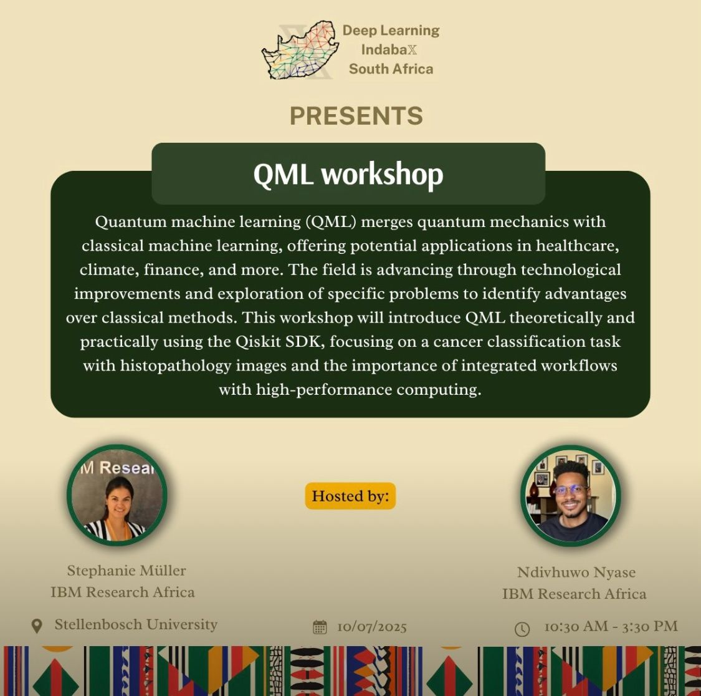

# QML4Africa Workshop

Welcome to the QML4Africa workshop at Deep Learning IndabaX! This hands‑on series will introduce you to quantum computing, and quantum machine learning (QML) concepts and practical coding exercises using Qiskit and related quantum tools.

Hosts: Ndivhuwo Nyase, Bonga Njamela, Stephanie Muller
Date: 11 July 2025 Thursday
Time: 10:00 - 15:30
Place: Stellenbosch University (Deep Learning IndabaX South Africa)
Room: M2002




## Table of Contents

1. [Introduction](#introduction)
2. [Prerequisites](#prerequisites)
3. [Setup & Installation](#setup--installation)
4. [Workshop Structure](#workshop-structure)
5. [Exercise 1: Getting Started](#exercise-1-getting-started)
   - [1.1 Superposition](#11-superposition)
   - [1.2 Bell State](#12-bell-state)
   - [1.3 GHZ State](#13-ghz-state)
6. [Exercise 2: Exploring the Bloch Sphere](#exploring-the-bloch-sphere)
- 2.1 Bloch Sphere Exploration
- 2.2 Gate Exploration 
8. [Exercise 3: Quantum Machine Learning](#qml)

---

## Introduction

Quantum Computing harnesses quantum mechanics—superposition, entanglement, and interference—to perform computations beyond classical limits. Quantum Machine Learning (QML) blends these quantum computing principles with machine learning to tackle problems that are intractable on classical systems. Over this workshop, you'll learn how to build, simulate, and run simple quantum circuits using Qiskit, culminating in basic QML models.

## Prerequisites

- **Python <=3.11+** installed
- **Conda** or **virtualenv** recommended
- **Git** for cloning repos
- Basic familiarity with Python programming

## Setup & Installation

1. Clone the workshop repository:
   ```bash
   git clone https://github.com/nnyase/QML4Africa.git
   cd QML4Africa
   ```
2. Create and activate a virtual environment:
   ```bash
   conda create -n qml4africa python=3.12
   conda activate qml4africa
   ```
3. Install required packages:
   ```bash
   pip install -r requirements.txt
   ```
4. Launch Jupyter Lab:
   ```bash
   jupyter lab
   ```
5. Open `getting_started.ipynb` to begin.
This notebook will guide you through the setup process on the IBM Quantum Platform where you will be granted 10 mins a month to utilize and code on actual quantum hardware.

## Workshop Structure

In this workshop You will:

- Understand basic quantum concepts like superposition
- Explore fundamental quantum gates, circuits and explore the bloch sphere.
- Simulate on Aer simulators and run on IBM Quantum hardware
- Progress to simple QML models using the IRIS dataset by the end of the series

## Exercise 1: Getting Started

In this first exercise, you will build foundational quantum circuits:

### 1.1 Superposition

- **Objective:** Prepare a single qubit in an equal superposition of |0⟩ and |1⟩.
- **Steps:**
  1. Create a 1-qubit circuit with 1 classical bit.
  2. Apply the Hadamard gate (`H`) to qubit 0.
  3. Measure the qubit into the classical bit.
  4. Simulate with 1024 shots and plot the histogram of outcomes (expect \~50% 0 and 50% 1).

### 1.2 Bell State

- **Objective:** Entangle two qubits to form a Bell (EPR) pair.
- **Steps:**
  1. Create a 2-qubit circuit with 2 classical bits.
  2. Apply `H` to qubit 0.
  3. Apply `CX` (CNOT) from qubit 0 → qubit 1.
  4. Measure both qubits and visualize the histogram (expect `00` and `11` only).

### 1.3 GHZ State

- **Objective:** Extend entanglement to three qubits, creating a GHZ state.
- **Steps:**
  1. Create a 3-qubit circuit with 3 classical bits.
  2. Apply `H` to qubit 0.
  3. Apply `CX` from qubit 0 → qubit 1, then `CX` from qubit 1 → qubit 2.
  4. Measure all qubits and plot (expect `000` and `111`).

## Exercise 2: Bloch Sphere & Gate Explorer

In this exercise, you'll interactively explore single-qubit states and gate operations using Bloch sphere visualizations.

### 2.1 Interactive Bloch Sphere

**Objective**: Visualize arbitrary single-qubit states on the Bloch sphere by adjusting spherical coordinates (θ, φ).

### 2.2 Gate Explorer

**Objective**: Apply various single-qubit gates and observe their effects on the Bloch sphere.

### 2.3 Discussion

Review classical bits vs. qubits, and how the Bloch sphere represents both superposition and phase.

Experiment with different gates and angles to understand rotations on the sphere.


## Exercise 3: Introduction to the QML using IRIS dataset

  In this exercise, we will demonstrate quantum computing and machine learning (ML) concepts explored during conference and help participants to consolodate their knowledge of QML. Using a quantum machine learning model we will predict the iris dataset.

3.1 Loading Classical Data onto a Quantum Circuit
3.2 Apply the Quantum Neural Network or Ansatz


- **Resources:**
  - Qiskit Documentation: [https://qiskit.org/documentation](https://qiskit.org/documentation)
  - IBM Quantum Experience: [https://quantum-computing.ibm.com](https://quantum-computing.ibm.com)

Happy quantum computing! 🚀

